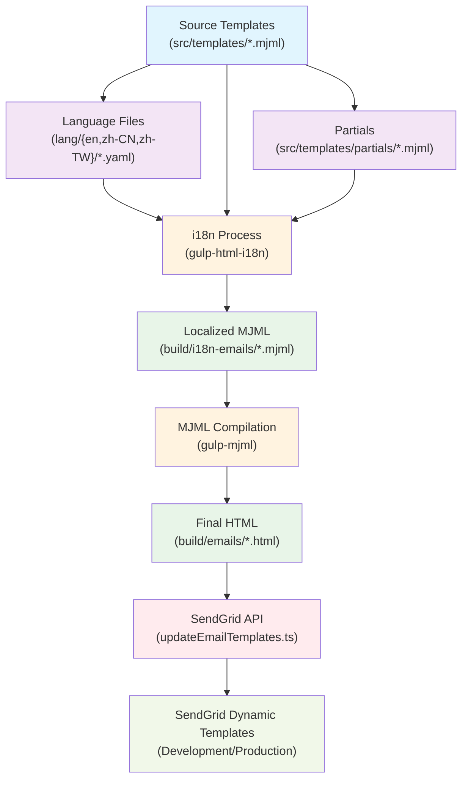
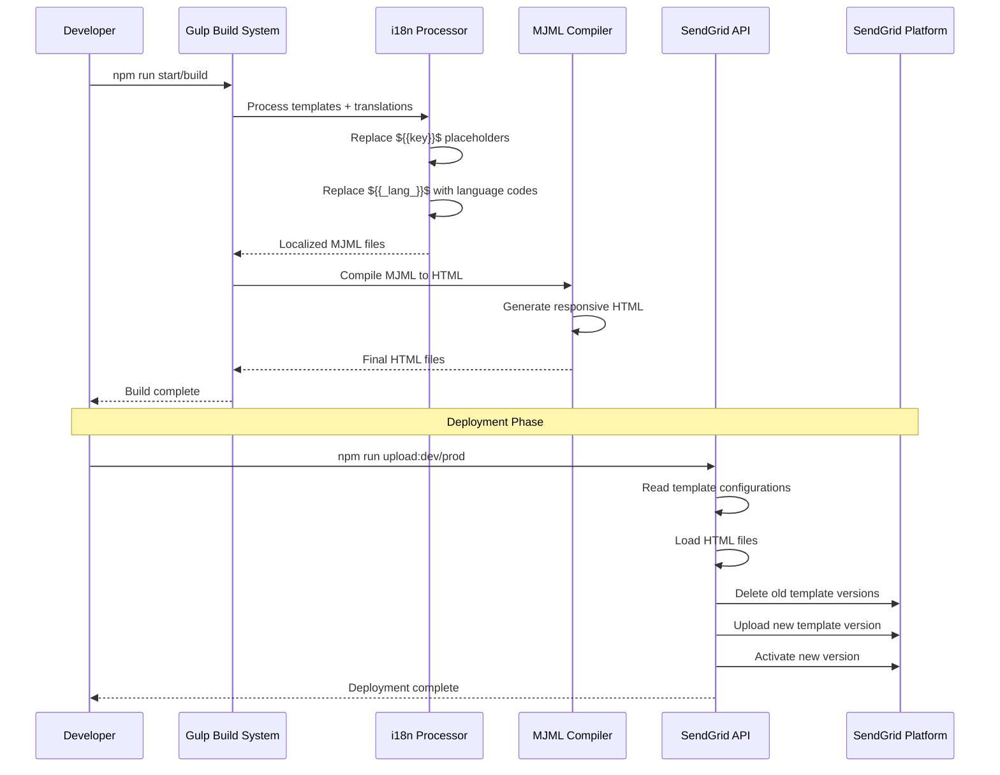
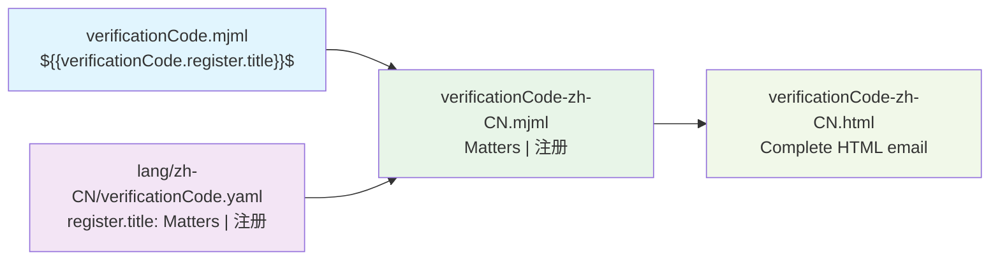
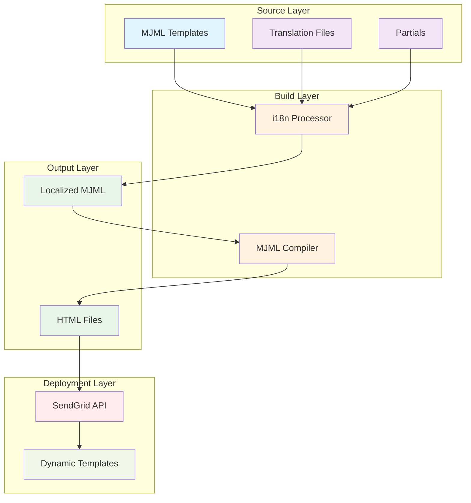
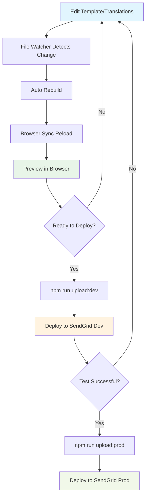

# Email Template Build Flow

## System Architecture Diagram

```mermaid
graph TD
    A["Source Templates<br/>(src/templates/*.mjml)"] --> B["Language Files<br/>(lang/{en,zh-CN,zh-TW}/*.yaml)"]
    A --> C["Partials<br/>(src/templates/partials/*.mjml)"]
    
    B --> D["i18n Process<br/>(gulp-html-i18n)"]
    A --> D
    C --> D
    
    D --> E["Localized MJML<br/>(build/i18n-emails/*.mjml)"]
    
    E --> F["MJML Compilation<br/>(gulp-mjml)"]
    
    F --> G["Final HTML<br/>(build/emails/*.html)"]
    
    G --> H["SendGrid API<br/>(updateEmailTemplates.ts)"]
    
    H --> I["SendGrid Dynamic Templates<br/>(Development/Production)"]
    
    style A fill:#e1f5fe
    style B fill:#f3e5f5
    style C fill:#f3e5f5
    style D fill:#fff3e0
    style E fill:#e8f5e8
    style F fill:#fff3e0
    style G fill:#e8f5e8
    style H fill:#ffebee
    style I fill:#f1f8e9
```

## Build Pipeline Details

```mermaid
sequenceDiagram
    participant Dev as Developer
    participant Gulp as Gulp Build System
    participant i18n as i18n Processor
    participant MJML as MJML Compiler
    participant SendGrid as SendGrid API
    participant SG as SendGrid Platform

    Dev->>Gulp: npm run start/build
    Gulp->>i18n: Process templates + translations
    i18n->>i18n: Replace ${{key}}$ placeholders
    i18n->>i18n: Replace ${{_lang_}}$ with language codes
    i18n-->>Gulp: Localized MJML files
    
    Gulp->>MJML: Compile MJML to HTML
    MJML->>MJML: Generate responsive HTML
    MJML-->>Gulp: Final HTML files
    
    Gulp-->>Dev: Build complete
    
    Note over Dev,SG: Deployment Phase
    
    Dev->>SendGrid: npm run upload:dev/prod
    SendGrid->>SendGrid: Read template configurations
    SendGrid->>SendGrid: Load HTML files
    SendGrid->>SG: Delete old template versions
    SendGrid->>SG: Upload new template version
    SendGrid->>SG: Activate new version
    SendGrid-->>Dev: Deployment complete
```

## File Transformation Example

```mermaid
graph LR
    A["verificationCode.mjml<br/>${{verificationCode.register.title}}$"] --> B["verificationCode-zh-CN.mjml<br/>Matters | 注册"]
    B --> C["verificationCode-zh-CN.html<br/>Complete HTML email"]
    
    D["lang/zh-CN/verificationCode.yaml<br/>register.title: Matters | 注册"] --> B
    
    style A fill:#e1f5fe
    style B fill:#e8f5e8
    style C fill:#f1f8e9
    style D fill:#f3e5f5
```

## Component Relationships

```mermaid
graph TB
    subgraph "Source Layer"
        A1["MJML Templates"]
        A2["Translation Files"]
        A3["Partials"]
    end
    
    subgraph "Build Layer"
        B1["i18n Processor"]
        B2["MJML Compiler"]
    end
    
    subgraph "Output Layer"
        C1["Localized MJML"]
        C2["HTML Files"]
    end
    
    subgraph "Deployment Layer"
        D1["SendGrid API"]
        D2["Dynamic Templates"]
    end
    
    A1 --> B1
    A2 --> B1
    A3 --> B1
    B1 --> C1
    C1 --> B2
    B2 --> C2
    C2 --> D1
    D1 --> D2
    
    style A1 fill:#e1f5fe
    style A2 fill:#f3e5f5
    style A3 fill:#f3e5f5
    style B1 fill:#fff3e0
    style B2 fill:#fff3e0
    style C1 fill:#e8f5e8
    style C2 fill:#e8f5e8
    style D1 fill:#ffebee
    style D2 fill:#f1f8e9
```

## Development Workflow

```mermaid
graph TD
    A["Edit Template/Translations"] --> B["File Watcher Detects Change"]
    B --> C["Auto Rebuild"]
    C --> D["Browser Sync Reload"]
    D --> E["Preview in Browser"]
    
    E --> F{"Ready to Deploy?"}
    F -->|No| A
    F -->|Yes| G["npm run upload:dev"]
    G --> H["Deploy to SendGrid Dev"]
    
    H --> I{"Test Successful?"}
    I -->|No| A
    I -->|Yes| J["npm run upload:prod"]
    J --> K["Deploy to SendGrid Prod"]
    
    style A fill:#e1f5fe
    style E fill:#e8f5e8
    style H fill:#fff3e0
    style K fill:#f1f8e9
```